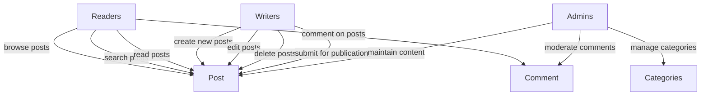

# Use Case Diagram

```mermaid
%%{init: {'theme': 'default'}}%%
graph TD
    A[Readers] -->|browse posts| B[Post]
    A -->|search posts| B
    A -->|read posts| B
    A -->|comment on posts| C[Comment]

    D[Writers] -->|create new posts| B
    D -->|edit posts| B
    D -->|delete posts| B
    D -->|submit for publication| B

    E[Admins] -->|moderate comments| C
    E -->|manage categories| F[Categories]
    E -->|maintain content| B
```
