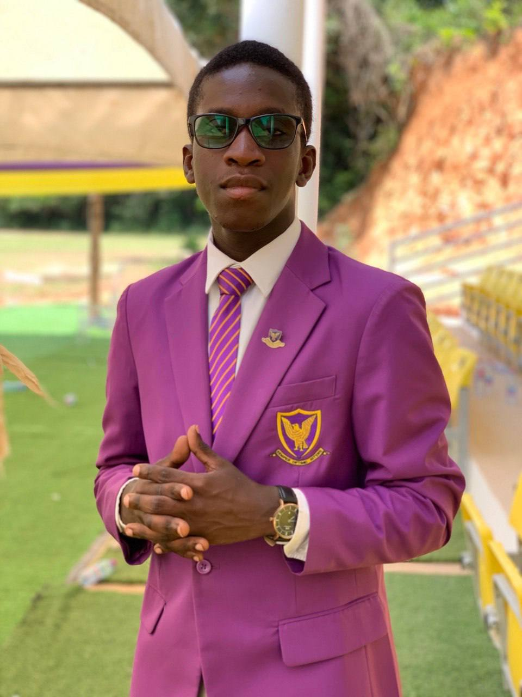

# Reflecting on My High School Journey 🎓

On November 21st, I stepped into Aggrey Memorial Senior High School in Cape Coast as a General Science student with an elective in Information Technology, driven by my passion to become a software engineer. I promised myself that I wouldn't come home empty-handed; though uncertain of what I would achieve, but I was determined.

High school life introduced me to new friends and experiences, but also challenges with seniors bothering freshmen, a common occurrence in Ghanaian high schools. The COVID-19 pandemic in 2020 led to school closures and the transition to online assignments and classes. Upon returning to school in November 2020, I was relieved not to encounter the troublesome seniors who had already graduated.

Returning to school, I had the privilege of meeting with the Head Prefect at the time. Impressed with my demeanor, he remarked that one day, I would be a Head Prefect like him. Though initially surprised, I chuckled at the thought of myself in such a role. Over time, we developed a close bond. In early 2021, I was honored to be elected as the first aspiring prefect and finally inducted into office in November 2021 as the Head Prefect Academics, working closely with the Head Mistress and learning invaluable lessons.

My tenure as Head Prefect was challenging yet rewarding, marked by improvements in academics and discipline.Looking back at my determination to bring something home, I am proud to have received awards for being the Most Disciplined Male Student and the Most Hardworking Head Prefect after completing my term.

## Morals Learned from Aggrey Memorial Senior High School:

- **Relationships and Respect:** I learned how to relate, respect, and handle situations with individuals I had authority over, my peers, juniors, and superiors. Understanding hierarchies in life is crucial.
- **Discipline and Responsibility:** Aggrey instilled in me a sense of discipline and responsibility, essential traits for success in any endeavor.
- **Effective Communication:** I honed my communication skills, understanding the importance of clear and effective communication in leadership roles.
- **Listening and Understanding:** I learned the value of listening to others and understanding their perspectives, working towards solutions rather than simply dismissing feedback.
- **Respect for Others:** I realized the importance of not seeing myself as superior to those beneath me but instead respecting them for choosing me as their leader.

Reflecting on my time at Aggrey Memorial Senior High School fills me with gratitude for the lessons learned and memories made. These experiences have shaped me into the person I am today, and I carry these values with me as I continue to grow and pursue my aspirations. 💫 #HighSchoolMemories #LeadershipJourney #AgrreyMemorial #SHS #HighSchool
